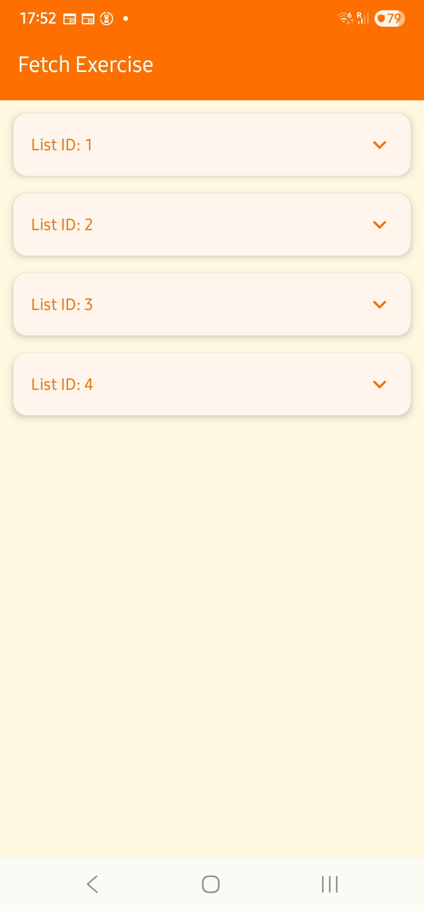
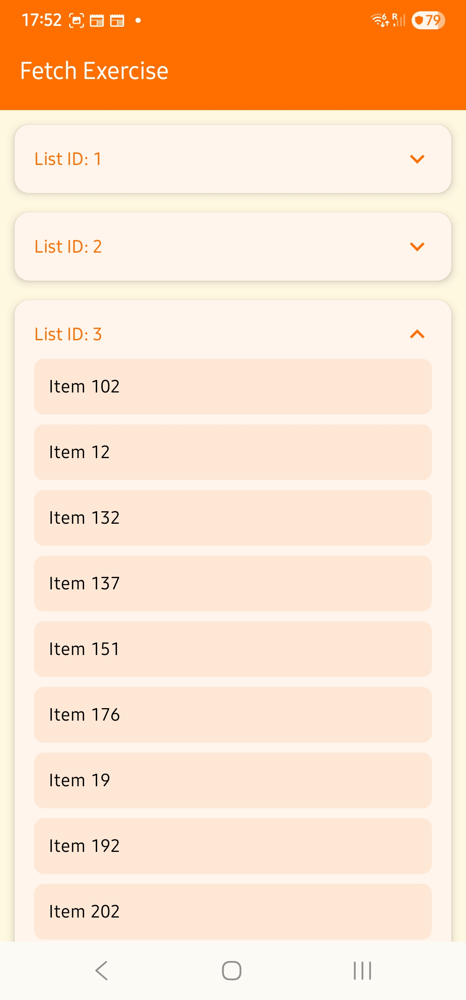
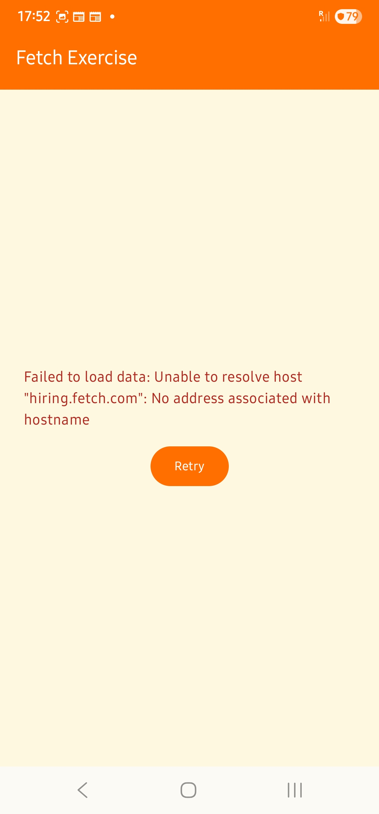
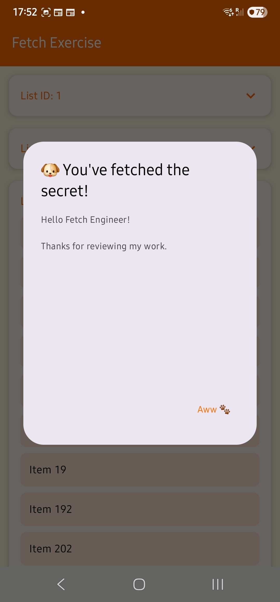

# Fetch Exercise - Mobile Coding Exercise (Android)

This is a native Android application built using **Kotlin** and **Jetpack Compose** for the coding exercise.

## ✨ Features

- ✅ Fetches data from `https://hiring.fetch.com/hiring.json`
- ✅ Filters out items with empty or null names
- ✅ Sorts items by `listId` and then by `name`
- ✅ Groups items by `listId`
- ✅ Expandable/collapsible grouped lists with arrow indicators
- ✅ Theming support (light/dark + Fetch brand color palette)
- ✅ Easter egg for Fetch developers 🐶
- ✅ Error handling with retry option
- ✅ Unit-tested `ViewModel`
- ✅ Fully implemented using **Jetpack Compose**

---

## 📱 Screenshots

| Grouped Lists                                | Expanded View                                 | Error UI                                 | Easter Egg                                 |
|----------------------------------------------|-----------------------------------------------|------------------------------------------|--------------------------------------------|
|  |  |  |  |

---

## 🚀 Getting Started

### Requirements

- Android Studio **Giraffe (or later)** (Developed in Android Studio Narwhal)
- Android SDK **33+**
- Kotlin **1.9+**

### Build & Run

1. Clone the repo:

2. Open in Android Studio

3. Build and run on emulator or physical device.

## 🧩 Dependencies

### Jetpack Compose
- AndroidX Compose BOM
- Compose UI, Material 3, Tooling, and Lifecycle integration
- Lifecycle ViewModel Compose

### Networking
- Retrofit
- Gson Converter

### Animation
- Lottie Compose (Airbnb)

### Testing
- JUnit
- Kotlin Coroutines Test
